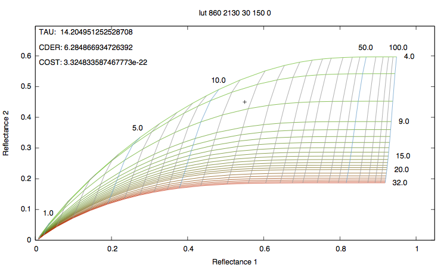
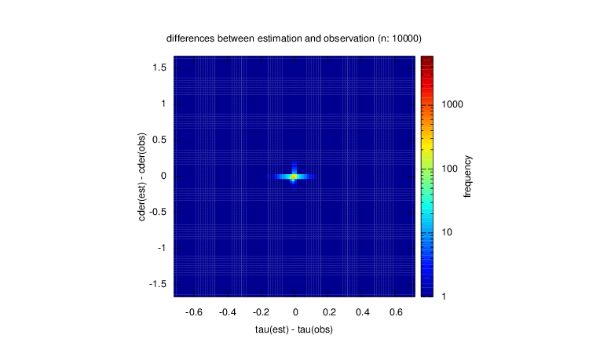

MICO-RE
===
MICO-RE 【miko-li / ミコリ】  
Minimal Implementation of Cloud Optical Retrieval

MICO-RE estimates cloud optical thickness (COT) and
cloud droplet effective radius (CDER) from reflectances in two wavelengths
by using look-up table (Nakajima and King, 1990) and Gauss-Newton method (Rodgers, 2000).  
Akima method (Akima, 1970) is used as a method of interpolation.


Cloud Optical Retrieval Code
---

### Installation

Just execute `make` command in `src` directory.

    $ cd src
    $ make

You can change your compiler setting in the `Makefile` (The default compiler is `gfortran`).

### Usage

    $ ./micore [lutfile] [surface_albedo] [reflectance1] [reflectance2]

like following:

    $ ./micore ../example/lut_860_2130.bin 0.0 0.553 0.343

If you enable the verbose flag (please read the part of tuning),
the output is composed by:

* observed reflectances,
* loaded LUT,
* for each iterate step,
    - estimated cloud parameters,
    - estimated reflectances,
    - cost,
* final cloud parameters and cost.

Final cloud parameters and cost are printed like:

```
 TAU:     13.206873367078288
 CDER:    6.2165327975806086
 COST:    1.1572150238204060E-020
```


Look-up table
---
Look-up table used in this program should be like following:

ex.)

| COT | CDER | REF1 | REF2 |
|:----|:-----|:-----|:-----|
| 1.0 | 3.0  | 0.20 | 0.10 |
| 1.0 | 5.0  | 0.20 | 0.13 |
| 1.0 | 7.0  | 0.21 | 0.15 |
| 1.0 | 9.0  | 0.23 | 0.14 |
| ... | ...  | ...  | ...  |
| ... | ...  | ...  | ...  |
| 2.0 | 3.0  | 0.26 | 0.14 |
| 2.0 | 5.0  | 0.26 | 0.18 |
| 2.0 | 7.0  | 0.27 | 0.19 |
| 2.0 | 9.0  | 0.29 | 0.18 |
| ... | ...  | ...  | ...  |
| ... | ...  | ...  | ...  |


This file should be given as a binary format.  
The data should be sorted like above.

An example of LUT is `example/lut_860_2130.bin` (SZA:30deg, VZA:30deg, RAA:0deg).

You can see the details by a command:

    $ od -f example/lut_860_2130.bin | less

LUT should be calculated by radiative transfer models (ex. RSTAR).


Utils
---

* lut\_plot.rb
* micore\_tester.rb

`lut_plot.rb` makes a Nakajima-King-like plot of the look-up table.

    $ ruby lut_plot.rb ../../example/lut_860_2130.bin with_point.png 0.0 0.55 0.45

It makes a plot like following:



`micore_tester.rb` makes a 2D histogram which represents
differences between true and estimated cloud properties
from random-generated cloud properties like following:



These scripts require 'gnuplot gem' and 'narray gem'.

Tuning
---

There are some technical parameters in the header of `micore_core.f90`.

``` fortran
  ! flag for verbose mode
  logical, parameter :: verbose_flag = .true.

  ! threshold value for convergence of cost function
  real(R_), parameter :: threshold = 1e-13_R_
  real(R_), parameter :: diff_thre = 1e-13_R_
  ! max # of iteration
  integer, parameter :: max_iter = 9999
  ! max and min of tau and cder
  real(R_), parameter :: tau_max  = 150.0_R_
  real(R_), parameter :: tau_min  = 0.3_R_
  real(R_), parameter :: cder_max = 35.0_R_
  real(R_), parameter :: cder_min = 1.0_R_
```

You can modify these parameters as you like before compiling.

Remarks
---

It is founded that the Akima interpolation cannot be applied to multi-dimensional data set
because the result of multi-dimensional interpolation depends on the order of interpolation.
However, on estimation of cloud properties, the effect doesn't affect so much.
In this code, the mean result of two different order of interpolation is used.

References
---

* [Teruyuki Nakajima and Michael D. King, 1990: Determination of the Optical Thickness and Effective Particle Radius of Clouds from Reflected Solar Radiation Measurements. Part I: Theory. J. Atmos. Sci., 47, 1878–1893.](http://journals.ametsoc.org/doi/abs/10.1175/1520-0469(1990)047%3C1878%3ADOTOTA%3E2.0.CO%3B2)
* [Rodgers, C. D., 2000: Inverse Methods for Atmospheric Sounding-Theory and Practice.](http://www.worldscientific.com/worldscibooks/10.1142/3171)
* [Hiroshi Akima, 1970: A new method of interpolation and smooth curve fitting based on local procedures. JACM, 17.4, 589–602.](http://dl.acm.org/citation.cfm?id=321609)

